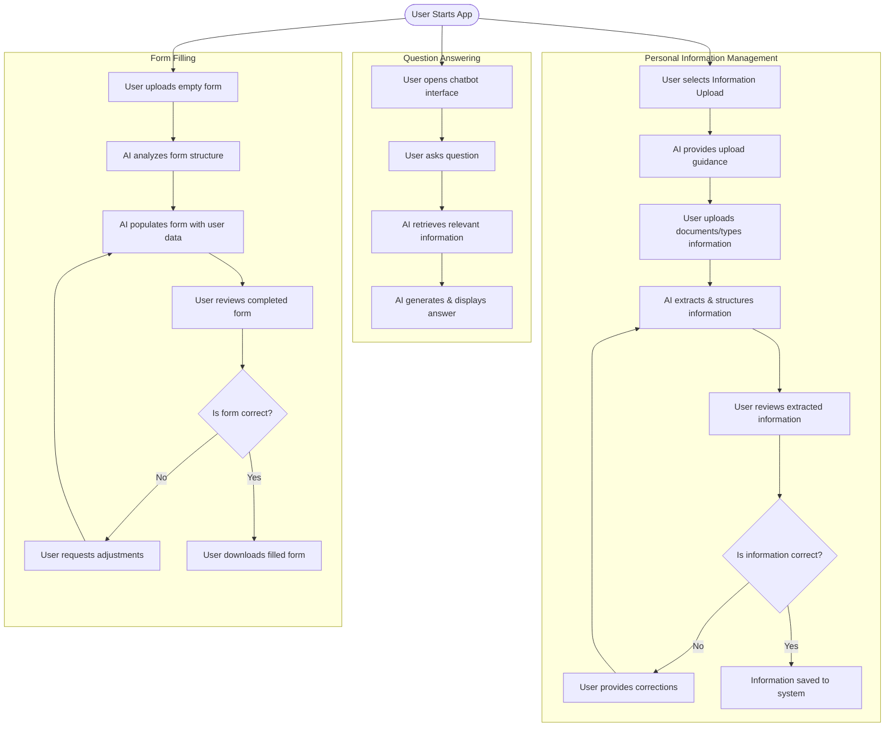

# 🚀 KI-Hackathon-2025

Repository for KI Hackathon - An AI-powered personal information management and form filling assistant.

## 🎯 Project Overview

This project aims to simplify personal information management and form filling through AI assistance. Users can upload their personal information through various formats, ask questions about processed data, and have forms automatically filled out based on their stored information.

## 📁 Project Structure

- **Frontend**: React-based UI with TypeScript
  - User interface components
  - API integration
  - Form visualization
- **Backend**: FastAPI Python backend
  - Data processing modules
  - AI agent integration
  - Document handling
  - Data storage
  - **Data** 
    - Scraped Data: Background knowledge from public sources
    - User Data: Securely stored personal information
- `README.md`: Project documentation

## 👤 User Experience Flows



## 🖥️ How to run frontend

1. Run `cd frontend` to move to frontend directory
2. Run `npm install` to **install** the required packages
3. Run `npm run dev` to **start** the development server (we will use this for now)
4. Open your browser to `http://localhost:5173` to view the application

## ⚙️ How to run backend

1. Run `cd backend` to move to backend directory
2. Run `python3 -m venv .venv` to **create** a virtual environment
3. Run `source .venv/bin/activate` to **activate** the virtual environment
4. Run `pip install -r requirements.txt` to **install** the required packages to the virtual environment
5. Run `uvicorn main:app --reload` to **start** the backend server
6. The API will be available at `http://localhost:8000`
7. Access API documentation at `http://localhost:8000/docs`

## 🐍 Python Virtual Environment tips

### 🔋 Virtual Environment Activation

- To **activate** the virtual environment, run `source .venv/bin/activate`
- To **deactivate** the virtual environment, run `deactivate`
- To **check** if the virtual environment is activated, run `which python3` and it should show the path to the virtual environment

### 📦 Installing packages

- Before installing packages, MAKE SURE the virtual environment is **activated**
- To **install** packages, run `pip install <package-name>`
- To **save** the installed packages to `requirements.txt`, run `pip freeze > requirements.txt`
  - `requirements.txt` is a file that contains all the packages installed (like `package.json` in Node.js)

## ✨ Features

### 🗃️ Data Handling

- **Background Knowledge** (Data Scraping and Processing)
  - Wolfsburg City Data
  - Public services information
  - Local regulations and requirements
  - Common form types and structures

- **User Data** (User Input)
  - Personal Information
    - Name, date of birth, nationality
    - Address and contact details
    - Family information
    - Professional and educational background
    - Financial information
  - Personal documents
    - ID card, passport
    - Certificates and diplomas
    - Tax documents
    - Prior applications and forms

### 🤖 AI Agent Implementation

- **Information Extraction Agent**
  - Extracts personal information from user input (text and documents)
  - Uses OCR techniques to identify relevant data points
  - Structures data into markdown format for verification
  - Provides guidance on missing or unclear information
  - Stores verified information in JSON format with appropriate schema
  - Handles updates and corrections to existing information

- **Q&A Agent (Chatbot)**
  - Answers user questions using background knowledge and personal data
  - Handles natural language queries about stored information
  - Helps users understand forms and requirements
  - Provides context-aware assistance
  - Maintains conversation history for better context understanding

- **Form Filling Agent**
  - Analyzes uploaded PDF forms to identify fields
  - Maps form fields to appropriate user data
  - Makes intelligent decisions when exact matches aren't available
  - Fills out PDF forms using stored personal information
  - Returns completed forms to the user
  - Explains which information was used and why

### 👤 User Interface

- **Start** (Landing Page)
  - Overview of available features
  - Quick access to main functionalities(Information Management, Chatbot, Form Filling)

## 🛠️ API Documentation

...


## start
```
cd chatbot
npm install
npm start
```

## backend
```
cd backend
npm install
npm start or node server.js
```
